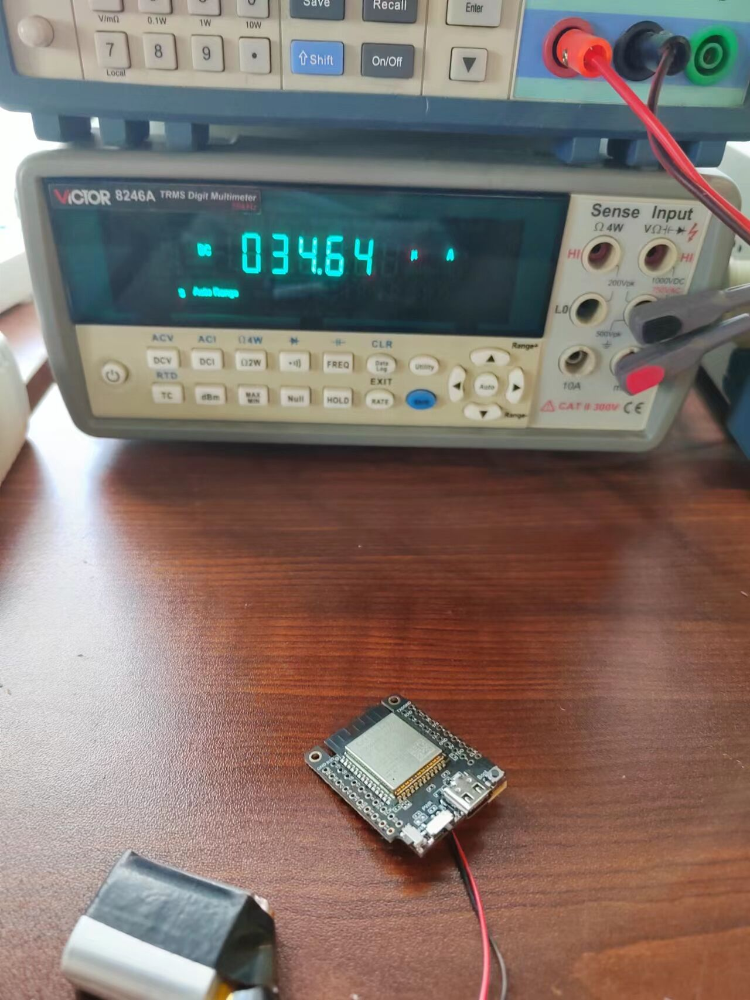

<h1 align = "center">🌟LILYGO T7-S3🌟</h1>

## **English | [中文](./README_CN.MD)**

<h3 align = "left">Quick start:</h3>

**USE PlatformIO**

1. Install[VSCODE](https://code.visualstudio.com/)and[Python](https://www.python.org/)
2. Search for the PlatformIO plug-in in the VSCODE extension and install it.
3. After the installation is complete and the reload is completed, there will be a small house icon in the lower left corner. Click to display the Platformio IDE home page
4. Go to file - > Open folder - > Select the T7-S3 folder and click the (√) symbol in the lower left corner to compile (→) for upload.

**USE Arduino IDE**

1. Install the current upstream Arduino IDE at the 1.8 level or later. The current version is at the [Arduino website](http://www.arduino.cc/en/main/software).
2. Start Arduino and open Preferences window. In additional board manager add url: https://raw.githubusercontent.com/espressif/arduino-esp32/gh-pages/package_esp32_index.json .separating them with commas.
3. Select Tools -> Board -> ESP32S3 Dev Module

**USE Micropython**

1. [Download and upload the firmware](https://micropython.org/download/GENERIC_S3_SPIRAM/)

<h3 align = "left">Product 📷:</h3>

| Product |                           Product  Link                            |
| :-----: | :----------------------------------------------------------------: |
|  T7-S3  | [AliExpress](https://www.aliexpress.us/item/3256804591247074.html) |

## Pinout

## Sleep

